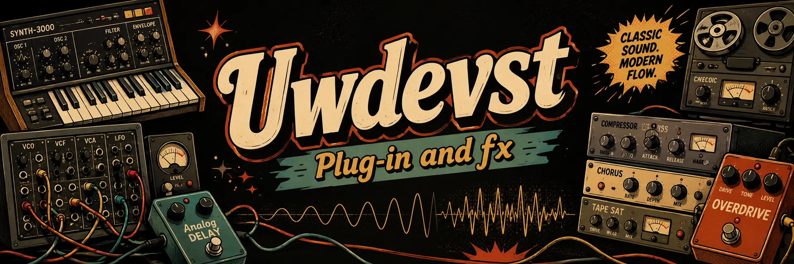

# 🦄 Unicorn Who Dev

**Product development · Audio · Local AI · 3D · Interactive experiences**

I build complete products across web applications, native audio, local artificial intelligence, computer vision, 3D and interactive experiences.

## Featured audio collection — UWdeVST

  

**18 free Windows VST3 plug-ins: 11 effects and 7 instruments, with official downloads and real audio demos.**

[Official website](https://unicorsoundengine.com/en) · [Listen](https://unicorsoundengine.com/en/demos) · [Downloads](https://unicorsoundengine.com/en/telechargements) · [License](https://unicorsoundengine.com/en/license) · [Commercial contact](https://unicorsoundengine.com/en/contact)

The source code is publicly viewable under the **UWdeVST Proprietary Public-Source License v1.0**. Official binaries are free for individuals and organizations with no more than EUR 100,000 in worldwide consolidated gross revenue. Modification and redistribution are not permitted; professional use above the threshold requires a separate paid written license.

| Effects | Instruments |
| --- | --- |
| [EQ & Filter](https://github.com/unicornwhodev/fx-eq) | [Bass](https://github.com/unicornwhodev/synth-bass) |
| [Dynamics](https://github.com/unicornwhodev/fx-dynamics) | [Piano](https://github.com/unicornwhodev/synth-piano) |
| [Delay](https://github.com/unicornwhodev/fx-delay) | [Drums](https://github.com/unicornwhodev/synth_drum) |
| [Reverb](https://github.com/unicornwhodev/fx-reverb) | [Guitar](https://github.com/unicornwhodev/synth-guitar) |
| [Distortion](https://github.com/unicornwhodev/fx-distortion) | [Percussion](https://github.com/unicornwhodev/synth-perc) |
| [Modulation](https://github.com/unicornwhodev/fx-modulation) | [Orchestra](https://github.com/unicornwhodev/synthe-orch) |
| [PitchTime](https://github.com/unicornwhodev/fx-pitchtime) | [Instruments](https://github.com/unicornwhodev/synthe-instr) |
| [Stereo](https://github.com/unicornwhodev/fx-stereo) |  |
| [Doubler](https://github.com/unicornwhodev/fx-doubler) |  |
| [Creative](https://github.com/unicornwhodev/fx-creative) |  |
| [Analyzer](https://github.com/unicornwhodev/fx-analyzer) |  |

`C++` · `JUCE` · `DSP` · `VST3` · `Windows`

## DAWWW-CORE

### 🎛️ [Local-first browser DAW](https://github.com/unicornwhodev/Daw-core-desktop)

DAWWW-CORE combines a sequencer, piano roll, arranger, mixer, automation and audio export with 51 built-in instruments and 16 built-in effects. Projects remain portable through the `.dw` format.

[GitHub repository](https://github.com/unicornwhodev/Daw-core-desktop) · [Open Desktop Studio](https://dawww-core-local.com/app) · [Documentation](https://dawww-core-local.com/en/docs)

`Web Audio` · `AudioWorklet` · `TypeScript` · `React` · `Local-first` · `Cross-device`

## Other projects

### 🎮 Make My Game

An experimental game-development project focused on character generation, sprite-sheet pipelines and multiple mobile game formats.

`Generative AI` · `Computer Vision` · `Unity` · `Python`

### 🔥 [FireViewer](https://github.com/fireviewer)

A separate R&D project focused on wildfire visual documentation and analysis: observation provenance, computer vision, geospatial data, reconstruction and simulation.

[GitHub](https://github.com/fireviewer) · [Hugging Face](https://huggingface.co/fireviewer)

FireViewer is a research and visualization project. It is not an official emergency alert or operational information service.

## What I work on

- **Audio and creative tools** — native DSP, VST3, Web Audio and music-production applications
- **Local AI** — generative models, computer vision, specialized models and model orchestration
- **3D and simulation** — Unity, OpenUSD, Omniverse, reconstruction and asset pipelines
- **Web applications** — React, TypeScript, Python and full-stack architectures
- **Developer tooling** — automation, pipelines, documentation and AI-assisted workflows

## Contact

- 🌐 [unicornwhodev.com](https://unicornwhodev.com)
- 🎚️ [unicorsoundengine.com](https://unicorsoundengine.com)
- 💻 [github.com/unicornwhodev](https://github.com/unicornwhodev)
- ✉️ [unicornwhodev@gmail.com](mailto:unicornwhodev@gmail.com)
